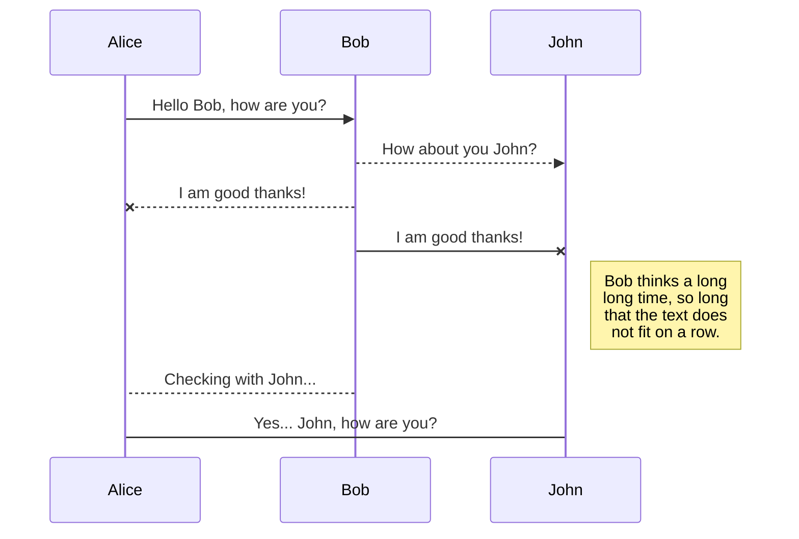
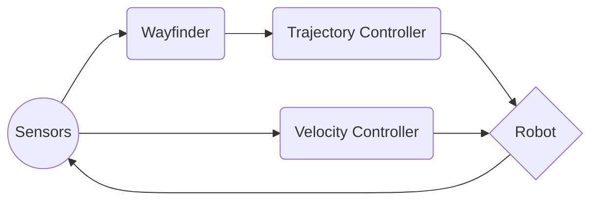

# Karina Navigation
 
This package was developed to provide autonomous navigation capabilities for the WRC Karina robot. Since previous renditions proved too inflexible, a new approach was taken to deliver a more reactive and intelligent navigation stack.

## General Architecture
The Karina Navigation Stack was designed for modularity and simplicity with a bottom-up approach. Navigation is broken into two tasks - trajectory and velocity control. Trajectory control is accomplished by a combination of local waypoint selection and a Dynamic Window Approach (DWA) controller. Velocity control is achieved by an agent, which monitors costmap and sensor data to adjust velocity and provide recovery behavior.

The trajectory controller is a 2 stage process which selects local waypoints to create a plan that it delivers to the robot. In the first phase, generated waypoints from VFH and Lane Follow are processed and are used to construct the plan (In this case - a single local waypoint). This plan is then sent to the next phase which features a controller that sends velocity commands to the drive motors.

The velocity controller is a single stage process which obtains information about Karina's local environment from the costmap and sensor readings. These readings are checked to ensure the robot

## Wayfinder Nodes
### Subsumptive
A subsumptive approach to wayfinding. This node listens to Vector Field Histogram and Lane Following topics, picking the higher priority (in this case, lane follow) waypoint. In the event that no waypoint is chosen, the robot simply moves forward.
| Subscribed Topics |Published Topics  |
|--|--|
|VFH Wpt / Status| Local Goal |
|LF Wpt / Status|

**Subscribed Topics**
- VFH Waypoint and Status
- Lane Follow Waypoint and Status

**Published Topics**
- Local Goal
### Path Collector
This node collects waypoints from Vector Field Histogram and Lane Following to establish a path which is post-processed then 
**Subscribed Topics**
- VFH Waypoint and Status
- Lane Follow Waypoint and Status

**Published Topics**
- Target Path
###  Euclidean Distance Transform
**Subscribed Topics**

**Published Topics**
## Controllers
### Proportional-Integral-Derivative (PID)
### Dynamic Window Approach (DWA)
## Installation
## Launch
## UML diagrams

 

You can render UML diagrams using [Mermaid](https://mermaidjs.github.io/). For example, this will produce a sequence diagram:

 

 

And this will produce a flow chart:

 

