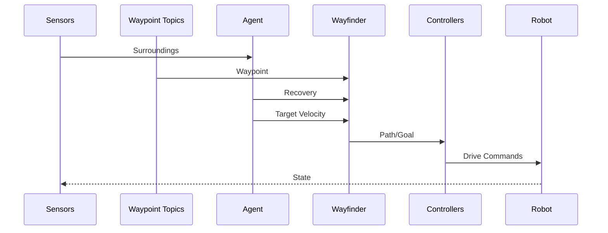
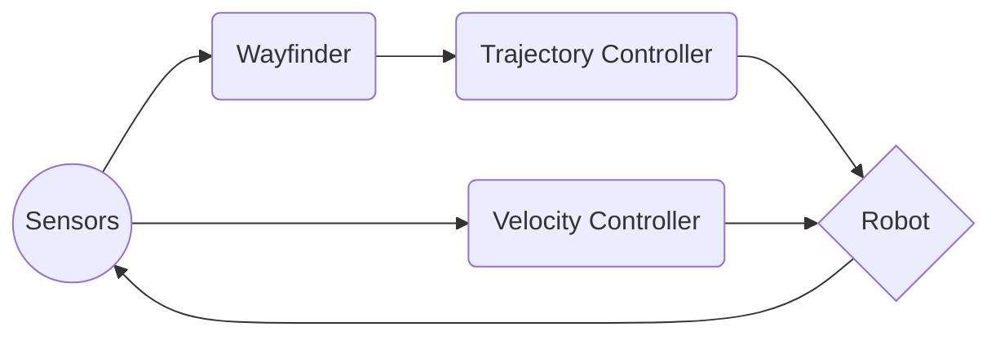
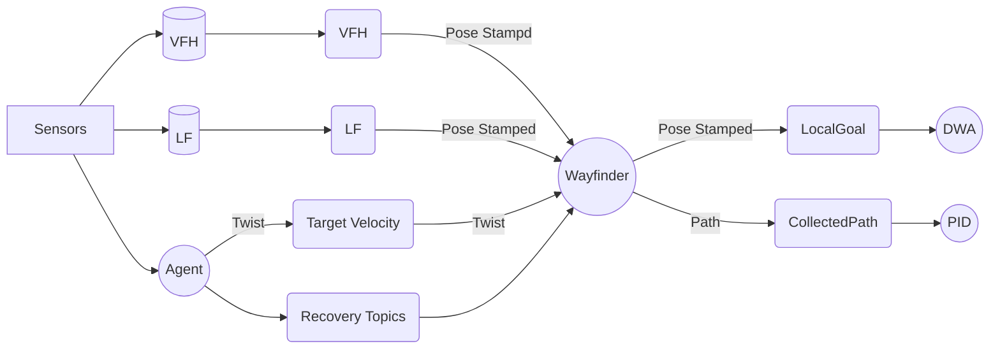

# Karina Navigation

This package was developed to provide autonomous navigation capabilities for the WRC Karina robot. Since previous renditions proved too inflexible, a new approach was taken to deliver a more reactive and intelligent navigation stack.

## General Architecture

The Karina Navigation Stack was designed for modularity and simplicity with a bottom-up approach. Navigation is broken into two tasks - trajectory and velocity control. Trajectory control is accomplished by a combination of local waypoint selection and a Dynamic Window Approach (DWA) controller. Velocity control is achieved by an agent, which monitors costmap and sensor data to adjust velocity and provide recovery behavior.

The trajectory controller (Wayfinder) is a 2 stage process which selects local waypoints to create a plan that it delivers to the robot. In the first phase, generated waypoints from VFH and Lane Follow are processed and are used to construct the plan (In this case - a single local waypoint). This plan is then sent to the next phase which features a controller that sends velocity commands to the drive motors.

The velocity controller (Agent) is a single stage process which obtains information about Karina's local environment from the costmap and sensor readings. These readings are checked to ensure no imminent collisions. If a collision is detected, the robot will reverse backwards away from the collision.

There are two types of controllers that are used in this model - Dynamic Window Approach (DWA) and Proportional-Integral-Derivative (PID) methods. DWA is useful for reactive navigation, as it only requires a waypoint on which it scores the available trajectories of the robot. The PID controller allows for more stable navigation, following the given path very closely. Thus, we utilize the PID controller when we are able to generate a path, and DWA when the generated path is inadmissable. These controllers are not included in this package and must be cloned seperately.

## Pathfinding Nodes

### Wayfinder

This node collects waypoints from Vector Field Histogram and Lane Follow. The node picks from the waypoints to assemble a path if possible, then sends the path to the PID Controller. If there is no admissable path generated, the Wayfinder resorts to a subsumptive approach in which the Lane Following waypoint supercedes the VFH waypoint. In the event that no waypoint is available, the robot is given a goal directly in front of it.

| Subscribed Topics  | |Published Topics  |
|--|--|--|
|VFH Wpt / Status|  | Local Goal |
|LF Wpt / Status| | Target Path |

### Euclidean Distance Transform (Not Yet Implemented)
This wayfinder node creates a local plan from local costmap data. It reads the costmap, binarizes the image, applies a euclidean distance transform, then selects the highest valued pixels as the path. This path is then sent to the PID controller.
| Subscribed Topics | |Published Topics  |
|--|--|--|
| Costmap |  | Path plan |

## Controllers

### Proportional-Integral-Derivative (PID)

A standard [PID Controller](https://github.com/BlaineKTMO/ros-pid-controller.git) which controls steering angle.

### Dynamic Window Approach (DWA)

A modified version of [Amslab's DWA planner](https://github.com/amslabtech/dwa_planner.git). This [DWA Controller](https://github.com/BlaineKTMO/modified-dwa) utilizes a Constraint Optimizer to select a dynamic window of available trajectories in the velocity and yaw space. The Constraint Optimizer reduces the number of trajectories sampled by removing impossible trajectories and then scores each trajectory based on a heuristic (cost function). It then sends a list of command velocities to the robot that match the chosen trajectory.

Traditionally, the Dynamic Window Approach utilizes the sum of velocity, obstacle, and heading errors multiplied by their respective gains and tries to minimize that heuristic. The Amslab implementation scored the trajectories as a cost function based on velocity, obstacle, and distance to goal. This is a slightly modified implementation using a cost function based on velocity, obstacle, heading, and distance.

## Installation

Clone git repository:
```bash
git clone https://github.com/BlaineKTMO/Karina-Navigation
```
Build with your preferred tool:
```bash
catkin build Karina-Navigation
```
or:
```bash
cd ~/workspace_dir/ && catkin_make
```

## Launch
Before launching, ensure you have built the repository from source. Then run:
```bash
rosrun karina_navigator wayfinder
```
```bash
rosrun karina_navigator watcher
```
These commands will start the decision making portion of the navigation stack. VFH and LF must be started for the nav stack to start. If the controllers are not active, the navigation stack still runs but the robot will not move.

## UML diagrams

### Action Diagram
This diagram shows the normal action flow for a single loop of the navigation stack. Sensor data is fed to the VFH and Lane Follow nodes, which each publish a waypoint that the Wayfinder reads. The wayfinder reads these waypoints and either outputs a path, or the chosen local goal.



### Information Flow Chart


### Topic Diagram
This diagram shows the subscriber/publisher relationships betweeen the nodes and topics.


